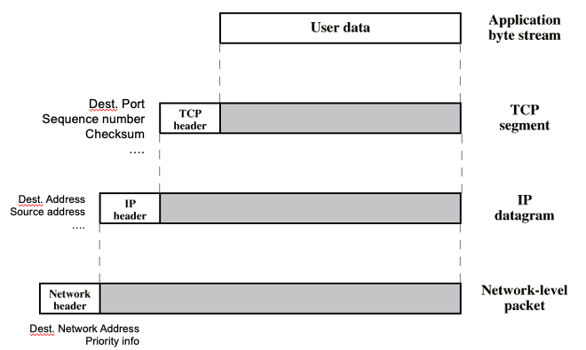
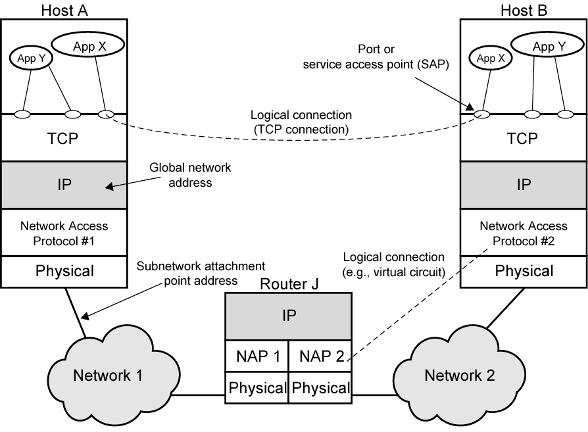

# TCP/IP Model 

### Definition:
-  One of the [Protocols](Protocols.md) architecture
- A set of communications protocols used on [The Internet](The%20Internet.md) and similar networks.
- Not an official layer structure based on [TCP-IP Protocol](TCP-IP%20Protocol.md)
### Layers:

#### Network Access (Internet) Layer
- **Purpose**: 
	- Facilitates data exchange between the computer and the network.
- **Techniques**: 
	- [Circuit Switching](Circuit%20Switching.md)
	- [Packet Switching](Packet%20Switching.md)
	- [LAN](LAN.md)s
- **Packets**: 
	- Includes network header for addressing and routing.
- **Key Protocol**: 
    - [IP (Internet Protocol)](TCP-IP%20Protocol.md#IP%20(Internet%20Protocol)): Manages packet addressing and routing.
#### Transport Layer
- **Purpose**: 
	- Ensures end-to-end communication and data integrity.
- **Characteristics**: 
	- Independent of the network and application used.
- **Ports**: 
	- Provide uniqueness, allowing multiple services on a single server.
- **Protocol Data Units (PDU)**: 
	- also called Packets
	- Data + Header + Trailer = PDU
	- Data may be fragmented during transport, with control information varying by layer.
		- Control info. is added/removed in each layer transaction
			- each layer has different header/trailer = each layer has different PDU
		- Control info:
			- Destination Port
			- Sequence number
			- Error Detection Code
	
- **Key Protocols**:
    - [TCP (Transmission Control Protocol)](TCP-IP%20Protocol.md#TCP%20(Transmission%20Control%20Protocol)): Reliable and ordered data delivery.
    - [UDP](UDP.md): Connectionless communication without guaranteed delivery order.
#### Application Layer
- **Purpose**: 
	- Delivers network services directly to user applications.
- **Key Protocols**: 
	- [HTTP](HTTP.md)
	- [SMTP](SMTP.md)
	- [FTP](FTP.md)
### TCP/IP Model Operation: 
