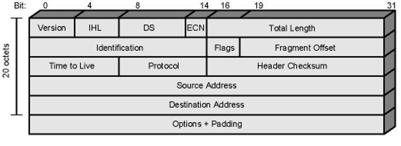
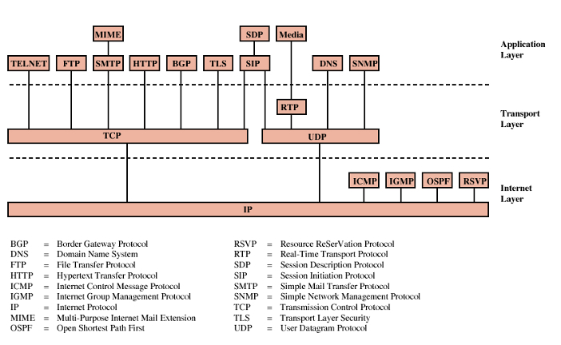

#NotFinished 
## TCP/IP Protocol Suite
### Definitions:
- TCP/IP Protocols created in 1974
	-  Founded by DARPA for its packet switched network ARPANET
- [TCP-IP Model](TCP-IP%20Model.md) constructed based on these protocols
- Used by [The Internet](The%20Internet.md) and [WWW](WWW.md)
#### TCP (Transmission Control Protocol):
- Ensures end-to-end communication, manages data packet assembly before transmission, and reassembly upon receipt, and provides error-checking to ensure data integrity.
- Responsible from reliability of transfer
- Connection-oriented protocol ensuring data is sent and received reliably.

#### IP (Internet Protocol): 
- **Defintion:**
	- Responsible for addressing and routing packets to ensure they reach the correct destination.
	-  Core of TCP/IP protocol suite
- **Properties**:
	- each packet treated separately 
	- provide connectionless (datagram) service
		- Advantages:
			- Flexible and robust -> good when congestion occurred
			- No overhead for connection setup
			- can work with different network types
		- Disadvantages
			- Unreliable
			- Not guaranteed delivery
			- Not guaranteed order of delivery
				- Packets can take different routes
- **Types:**
	- IPv4: 
		- Uses a 32-bit addressing scheme. 
		- Most commonly used.
		
	- IPv6: 
		- Uses a 128-bit addressing scheme. 
		- Newer and offers more addresses.
		- Not backward compatible
### Example of Protocols:
