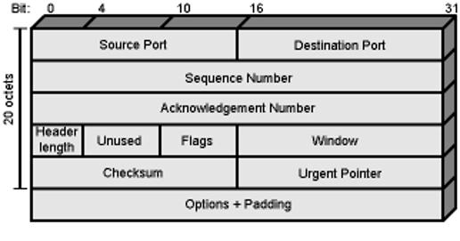

## TCP/IP Protocol Suite
### Definitions:
- TCP/IP Protocols created in 1974
	-  Founded by DARPA for its packet switched network ARPANET
- [TCP-IP Model](TCP-IP%20Model.md) constructed based on these protocols
- Used by [The Internet](The%20Internet.md) and [WWW](WWW.md)
#### TCP (Transmission Control Protocol):
- Ensures end-to-end communication, manages data packet assembly before transmission, and reassembly upon receipt, and provides error-checking to ensure data integrity.
- Connection-oriented protocol ensuring data is sent and received reliably.

#### IP (Internet Protocol): 
- Responsible for addressing and routing packets to ensure they reach the correct destination.
- IP (Internet Protocol)
- Core of TCP/IP protocol suite
- IPv4: 
	- Uses a 32-bit addressing scheme. 
	- Most commonly used.

- IPv6: 
	- Uses a 128-bit addressing scheme. 
	- Newer and offers more addresses.
	- Not backward compatible
### Example pf Protocols:
