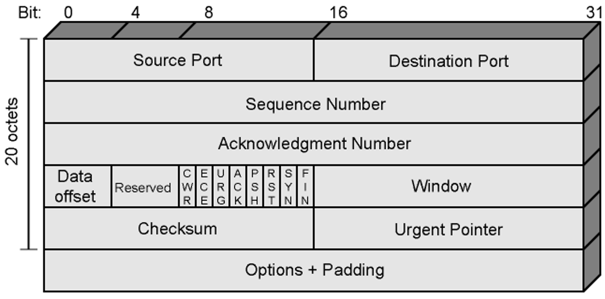

## TCP (Transmission Control Protocol)
### Definition:
- One of the protocols of [TCP-IP Protocol](TCP-IP%20Protocol.md) suite
- Defined in RFC 793
- Connection-oriented protocol ensuring data is sent and received reliably.
	- Ensures end-to-end communication
	- Manages data packet assembly before transmission, and reassembly
	- Provides error-checking to ensure data integrity.
	- Reliable
### Properties:
-  **Service Primitives and Parameters:**
	- Layer-to-layer services are defined in terms of primitives and parameters
	- Primitive specifies function to be performed
	- Types of primitives
		- Passive / Active open
		- Send / Deliver data
		- Close primitives
		
	- Parameters pass data and control information
		- Ports, IP addresses, data, flags (PUSH, URGENT), etc.
	- Items passed to IP
	- Payload length
		- TCP Payload Length = Total Length - (IP Header Length + TCP Header Length)
- Difficulties:
	- Segments may arrive out of order
		- SN in TCP header helps to reorder
	- Segments may be lost
		- SN and positive ACKs
		- TCP retransmits lost segments (after timeout)
			- Save copy in segment buffer until acknowledged
		- !!! No negative acknowledgment in TCP
- Special Capabilities:
	- Data stream push
		- Normal case 
			- While sending -> buffers data until enough data available to form a segment 
			- While receiving -> buffers data instead of bugging upper layer protocol for each segment received
		- Push flag Case
			- Requires transmission of all outstanding buffered data up to and including that labeled with a push flag
			- Receiver will deliver data in same way
	- Urgent data signalling
		- Tells destination user that significant or "urgent" data are coming
		- Destination user determines appropriate action
### Connection Management:
- **Multiplexing:**
	- Single TCP can provide service to multiple upper layer processes
	- Processes are identified with port
	- Port + IP address = socket
	- Logical connection is between two sockets
- **Connection Establishment:**
	- Set up logical connection between two sockets
	- Connection between two sockets can be set up if: 
		- No connection between these sockets currently exists
		- Internal TCP resources (e.g., buffer space) are sufficient
		- Both users agree 
### Operation
- Data transmitted in segments
	- TCP header and portion of user data
	- Some segments carry no data -> For connection management
- Data passed to TCP by upper layer in sequence of Send primitives
- Buffered in send buffer
- TCP takes data from buffer into a segment and transmits (occasional -> push flag)
- Segment transmitted by IP service
- Delivered to destination TCP entity
- Strips off header and places data in receive buffer
- TCP notifies its user by Deliver primitive that data are available (occasional)
### TCP Header
- **CheckSum:**
	- Covers entire segment plus a pseudo header
		- Pseudo header contain = source and destination IP addresses, protocol, length field of IP header
		- Idea: with pseudo header, destination TCP layer can detect address/delivery and length inconsistencies that might have happened in IP layer
			- Reliability
			- Protocol independence principle violated
- **Options:**
	- **Maximum Segment Size:** Included in SYN segment
	- **Window Scale:** 
		- Included in SYN segment
		- Window field gives credit allocation in bytes
		- Value in Window field multiplied by $2^F$ (F =  value of window scale option)
	- **Sack-permitted:** Selective acknowledgement allowed
	- **Sack:** 
		- Allow the receiver to acknowledge non-consecutive data
		- Sender can retransmit only what is missing at the receiver's end
	- Some options that are passed to TCP by upper layer (via primitives and parameters) are not in TCP header
		- They are passed to IP and included in IP header
			- IP addresses
			- Basic Quality of Service Parameters related to the network
	- Payload length -> did not directly send, but we can calculate it via
		- TCP Payload Length = Total Length - (IP Header Length + TCP Header Length)

### Mechanisms:
- **Connection Establishment:**
	- Three-way handshake
	- Between pair of sockets
	- There can be a only single TCP connection between a unique pair of sockets
- **Data transfer**
	- Stream of bytes
	- Bytes numbered modulo $2^{32}$
	- Segments contain sequence number of the first byte
	- Flow control by credit allocation of number of bytes
	- TCP decides when to construct a segment -> exception: push flag
- Connection termination
	- Graceful close
		- Prevent losing data -> all outstanding data will be transferred  before closing 
		- TCP user issues CLOSE primitive
		- Transport entity sets FIN flag on last segment sent
	- Abrupt termination 
		-  data might be lose
		- ABORT primitive issued by TCP user
		- TCP entity abandons all attempts to send or receive data
		- RST segment transmitted
### Policies:
- **Send policy:**
	- If there is no push -> TCP entity transmits at its own convenience
		- Data buffered at transmit buffer
		- May construct segment per data batch provided by TCP user
		- May wait for certain amount of data
	- Performance Trade-off:
		- Infrequent and large segments
			- low processing/header overhead -> slow response (large delay)
		- Frequent and small segments
			- quick response (small delay) -> high processing/header overhead
- **Deliver policy:**
	- If there is no push -> TCP delivers data at its own convenience
		- May deliver as segments are received
		- May buffer several segments and then deliver
	- Performance trade-off
		- If TCP delivers data immediately
			- small delay -> fast response
			- High processing overhead
		- IF TCP buffer data
			- High delay -> slow response
			- small processing overhead
- **Accept policy:**
	- Segments may arrive out of order
	- To organize segments two method are available:
	- In order method:
		- Only accept in-order segments
		- Discard out-of-order segments
		- Easy implementation, simple
		- Lots of retransmissions
	- In window method
		- Accept all segments within receive window
		- Complicated
		- Large buffers
		- Less retransmissions
- **Retransmit policy:**
	- TCP source maintains a list of segments transmitted but not acknowledged
	- TCP will retransmit if does not receive ACK in given time
	- To retransmit three method are available
	- First only method
		- Single timer for all segments waiting ack
			- Reset when an ack is received
		- If expires the oldest segment waiting ack is retransmitted
		- Few retransmissions
		- Longer delays for the other lost segments
	- Batch method
		- Single timer for all segments waiting ack
		- If expires all segments waiting ack are retransmitted
		- Smaller delays 
		- Unnecessary retransmissions
	- Individual method
		- One timer per segment
		- Segment whose timer is expired is retransmitted
		- Complex implementation
- **Acknowledge policy:**
	- Immediate ACK
		- Immediately send an ack message without data
		- Limits unnecessary retransmissions
		- Increase the traffic by ACKs
		- Not widely used
	- Cumulative ACK
		- Wait for outgoing data and then add cumulative ack to the data segment (piggybacking)
		- Typical method
		- Problem in estimating timer values for retransmissions at the sender