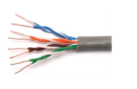

### Definition:
- One of the types of [Guided Media](Guided%20Media.md)
- Common in local area networks([LAN](LAN.md)) and telephone systems.
- Detailed information about [Twisted Pair Cables](https://www.geeksforgeeks.org/twisted-pair-cable/)

### Types:
- **Shielded Twisted Pair (STP)**:
	- Metal braid or sheathing that reduces interference
	- More expensive
	- Harder to handle (thick, heavy)
	- Not so economical for low rates, but a good alternative for higher rates
	- IBM invention
- **Unshielded Twisted Pair (UTP)**:
	- Ordinary telephone wire, but can be used for data as well
	- Cheaper
	- Easier to install
	- Suffers from external EM interference, so insulation is important.
	- [UTP Categories](UTP%20Categories.md)
### Pros & Cons:
- **Pros:** 
	- Cheap
	- easy to work with
- **Cons:** 
	- Short range
	- vulnerable to EM interference (via Tapping)
	- Low data rates (but today with Cat7 cables its possible to get 40 Gbps)