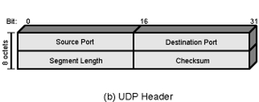

## User Datagram Protocol (UDP)
### Defintion:
- One of the Protocols in [TCP-IP Protocol](TCP-IP%20Protocol.md)
- Connectionless protocol for faster, but possibly unordered, data transfer.
	- end-to end protocol
	- not guaranteed delivery
	- no preservation of sequence
	- no protection against duplication
	- minimum overhead (fast)
### Usage:
- Used to transfer data in [DNS](DNS.md) application
- Data collection
	- periodic reports from network devices
	- Sensor data
- Data dissemination (mostly broadcast)
	- real-time clock
- Real-time application
	- video
