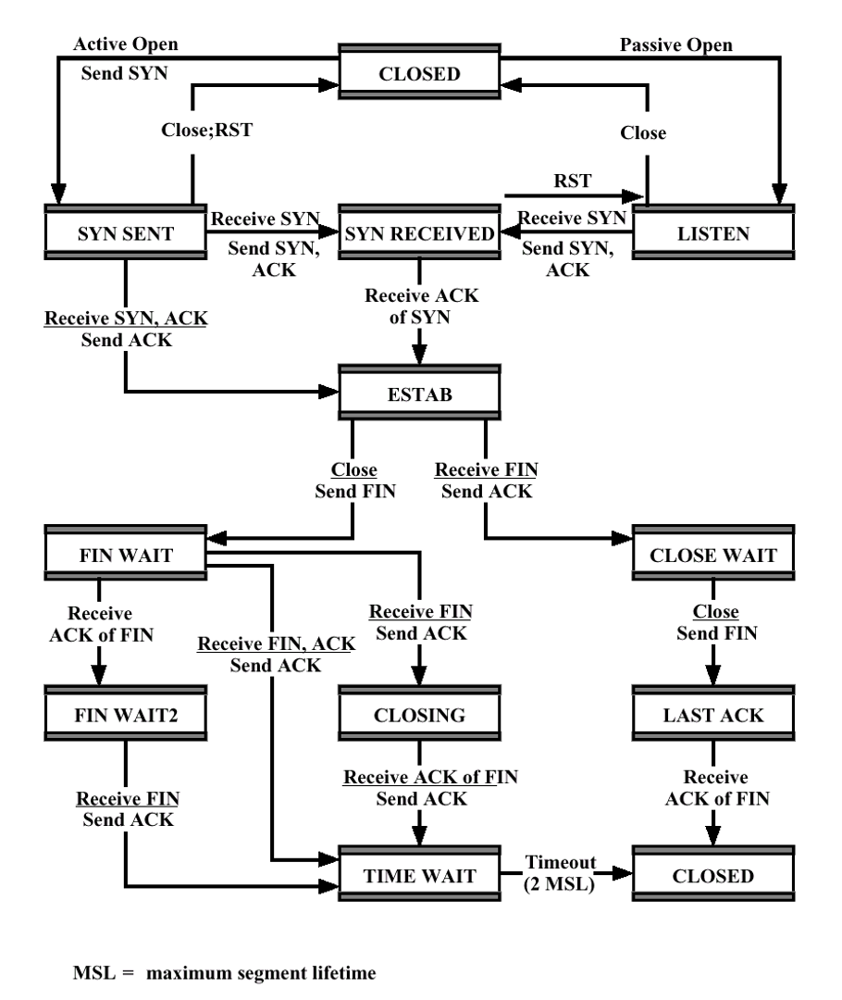

### Design Issues in Transport Layer
- One of the design issues in [Transport Layer](Transport%20Layer.md)
- Case assumption: assume unreliable Network Service
- Typical Case ->Uses [IP](IP.md)
	- Segments may lost
	- Segments may arrive out of order
## Ordered Delivery:
- Problem: Segments may arrive out of order
- Solution: number data units sequentially and reorder the segments accordingly
- TCP numbers each bytes sequentially
	- implicit numbering
	- segments are numbered by the first byte number in the segment
	- length of the segment is also known
	- So, sequence number of the next in-order segment known
## Retransmission strategy:
- Problem:
	- Segment may be damaged while in transit
	- Segment may fail to arrive
	- Transmitter may not know of failure
- Solution: Positive acknowledgment
	- receiver must acknowledge successful receipt
	- No negative acknowledgments in TCP
	- Cumulative acknowledgment used 
		- several segments can be acknowledged in one ack message
	- Waiting ACK for a long time (timeout) -> triggers re-transmission
## Timer values:
- Used to decide timeout duration
- There are two approaches 
- **Fixed timer:**
	- Based on typical network behavior
	- Cannot adapt to changing network conditions
	- Too small -> unnecessary re-transmissions
	- Too large -> slow response to lost segments
	- Should be a bit longer than rtt (round trip time), but rtt is not fixed
- Adaptive Timer:
	- Based on average round-trip time. But this mechanism also has problems
	- May not ACK immediately due to cumulative ACKs.
	- Conditions may change suddenly
- No complete solution -> there are some heuristics 
## Duplication detection:
- If segments are lost and retransmitted -> no problem
- If ACK lost -> segments are retransmitted
	- Original one may arrive after the retransmitted one
	- Receiver must recognize duplicates
	- Two case
- Case1: Duplicate received before closing connection
	- Receiver assumes that ACK is lost and sends ACK for the duplicate
	- Sender must differentiate these two cases: 
		- multiple ACKs for the same segment
		- ACK for a new segment with the same seq. number
	- Sequence number space must be large enough in order not to cycle within maximum lifetime of a segment 
- Case2: Duplicate received after closing connection
	- Solution: having sequence numbers in connection establishment and using distant initial sequence numbers in adjacent connections
## Flow control:
- Credit allocation scheme is robust and flexible
	- it is possible to increase credit without ack 
		- after (AN = i, W = j)
		- send (AN = i, W = k), k > j
	- it is possible to ack without extra credit
		- after (AN = i, W = j)
		- send (AN = i + m, W = j - m)
		- m = acknowledged segment length
- Lost ACK/CREDIT is not a problem
	- future ACKs resynchronize the protocol
	- lost ack causes timeout and retransmission -> retransmission triggers ack
- Possible deadlock:
	- receiver temporarily closes window with AN=i, W=0
	- later reopens with AN=i, W=j, but this is lost
	- Sender thinks window is still closed, receiver thinks it is open
- Solution: window timer
	- timer employed for each outgoing ACK/CREDIT segment
	- timer expires if no new ACK/CREDIT segments are sent within the timeout period
	- if timer expires, retransmit the previous ACK/CREDIT segment
## Connection Establishment:
- Two way handshake
	- A sends SYN, B replies with SYN
	- Lost SYN handled by retransmissions via some timers
	- May cause to duplicate SYNs -> Ignore duplicate SYNs once connected
	- Delayed data segments can cause connection problems
	- Problematic not used
- **Obsolete Data Segment Problem:**
	- Problem:
		- packets from an old connection might be confused with segments from a new connection 
		- if they have overlapping sequence numbers (SN)
	- **Solution**: To prevent this, the 
		- first segment number of the new connection must be significantly different from the last segment number of the previous connection
		- expected SN specified in the connection
			- Use SYN i  
			- i + 1 -> SN of  the first segment to be sent on that connection  
			- acknowledged by SYN j  
			- j + 1 is the first byte number on the other direction
		- Creates Obsolete SYN Problem
- **Obsolete SYN Problem:**
	- **Issue**: 
		- SYN segment from an old connection attempt could be delayed and then mistakenly appear to initiate a new connection
	- **Solution**: 
		- ACKs should include the SYN number i from the request plus 1 (AN = i+1)
>To see detailed cases for solution and problem please look at the transport layer slide page 29-32
- Three way handshake -> ensure reliable connection
	- SYN  
	- SYN-ACK
	- ACK (of SYN)
	- 
## Connection Termination:
- Problem:
	- If we use In two-way handshake
	- Entity in CLOSE WAIT state sends last data segment, followed by FIN
	- FIN arrives before last data segment (now possible since the network is unreliable)
- Receiver accepts FIN
	- Closes connection
	- Loses last data segment
- Solution: 
	- Add last byte of  SN to FIN 
	- Receiver waits for all segments up to and including this sequence number in FIN
	- After that it sends ack for FIN
	- This is repeated for same as Sender
- In Graceful close, initiating entity should:
	- Send FIN i and receive its ack (AN i+1)
	- Receive FIN j and send its ack (AN j+1)
	- Wait twice maximum expected segment lifetime
		- Since, final ack may not be received by receiver.
		- If another FIN is received within this period
		- Final ack is retransmitted
		- 