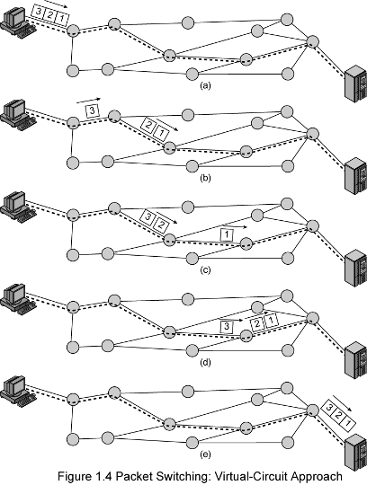

## Virtual Circuit Approach
- One of the type of [Packet Switching](Packet%20Switching.md) approaches
- **Pros**
	- All Packets use the same route
		- Packets are coming same order and they are not lost
	- Routing decision is not required (has virtual circuit identifier)
	- Faster than datagram
		- Packets are still buffered at switching nodes and queued for output
		-  store, process and forward exist
	- Less flexible, less reliable
		- Loss of a node looses all circuits thought that node (since uses same path)
		- Not a responsive to cognition

