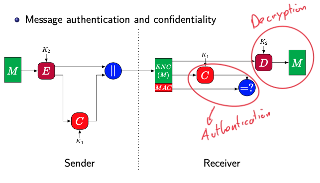
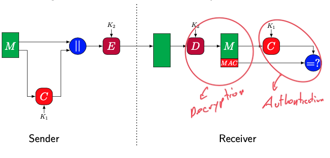
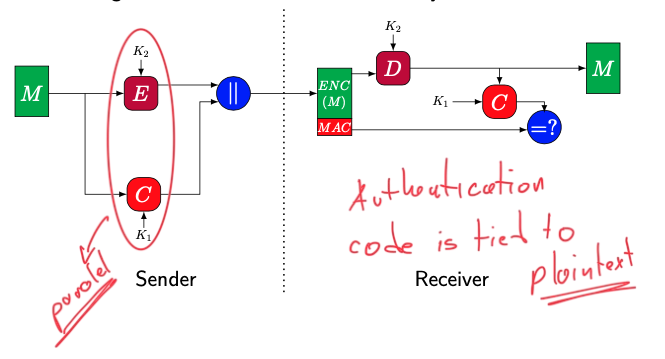

## Authenticated Encryption with Associated Data (AEAD)
### Definiton:
- Encryption systems that simultaneously protect confidentiality and authenticity of communications
- Based on [AES](AES.md) and [Cryptographic Hash Functions](Cryptographic%20Hash%20Functions.md)
	- Encryption Scheme + [Message Authentication Codes (MAC)](Message%20Authentication%20Codes%20(MAC).md)
### Types
- **Encrypt-then-MAC(EtM)**:
	- Provide message authentication and confidentially in same time
	- Authentication is tied to ciphertext
	- Can be parallelized
	
- **MAC-then-Encrypt(MtE)**:
	- Provide message authentication and confidentially in same time
	- Authentication is tied to ciphertext
	- Cannot be parallelized
	
- **Encrypt-and-MAC(E&M)**:
	- Provide message authentication and confidentially in same time
	- Authentication is tied to ciphertext
	- Sender can parallel but Receiver can not parallel
	