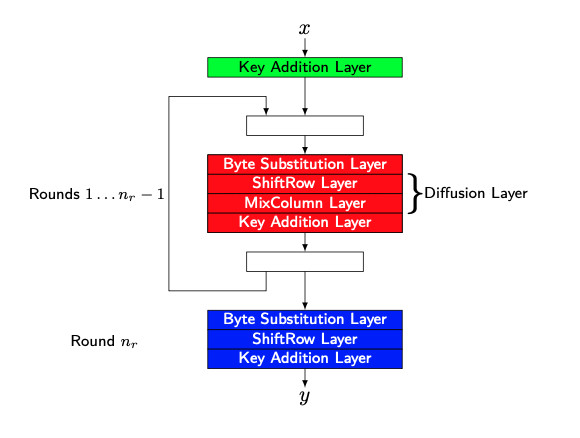
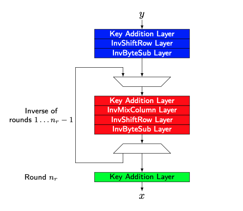

## Advanced Encryption Standard (AES)

### Type:
- [Symmetric Key Cipher](Symmetric%20Key%20Cipher.md) and [Block Cipher](Block%20Cipher.md)
### History: 
- Established by the U.S. National Institute of Standards and Technology (NIST) in 2001.
- Serves as the successor to the Data Encryption Standard ([DES](DES.md)).
- First name was Rijndael.
- Detailed AES explanation: [Wiki AES](https://tr.wikipedia.org/wiki/AES)
### Key Length: 
- Supports three key lengths: 128, 192, and 256 bits.
- S-Box used to generate round keys via [GF](GF.md)($2^8$)
- The number of rounds in the transformation process varies:

| Key length(in bits) | Number of rounds |
| ------------------- | ---------------- |
| 128                 | 10               |
| 192                 | 12               |
| 256                 | 14               |
- In every round each bit in the block are treated uniformly
- Since block size is fixed and 128/192/256-bit blocks to encrypt larger data blocks we use [Modes of Operations](Modes%20of%20Operations.md)
### Operation: 
- Not a Feistel Network
	- Therefore it can process whole block which is explains that how it has fewer rounds
	- Remember DES has 16 rounds
- Designed for both hardware and software
- In every round, each bit in the block are treated uniformly
	- After two round each of the 128/192/256 output bits depends on each of the 128/192/256) input bits
	- Provides high [diffusion](Diffusion%20&%20Confusion.md)
- Has three basic steps:
	1. **Key Addition Layer:** XORing the block with the round key
	2. **Byte Substitution Layer:** 
		- Non-linear substitution step where each byte is replaced with another according to a lookup table.
			- 8-by-8 substitution (s-box)
				- It is based on [GF](GF.md)
				- $x \mapsto x^{-1} \text{ in } \text{GF}(2^8) = x^8 + x^4 + x^3 + x + 1$
				- Balanced 
				- Highly Non-linear operation ([confusion](Diffusion%20&%20Confusion.md))
			- Has constant mapping (efficiency)
	3. **Diffusion Layer:** 
		- Provides the diffusion of the bits of a block
		- **ShiftRows**: A transposition step where bytes in the block's rows are shifted cyclically.
		- **MixColumns**: A mixing operation which operates on the columns of the data block, combining the four bytes in each column.
- Encryption and Decryption operations are different:
	- **AES Encryption:**
		- In last round we don't perform MixColumn Layer
		- 
	- **AES Decryption:**
		- In first round we don't perform InvMixColumn Layer
		- 
### Security: 
- No known attacks are better than brute force for seven or more rounds
- Key length make infeasible the brute force attacks
- Considered as most secured system until now
- Combination of AES with [CBC](CBC.md) ensure [Semantic Security](Semantic%20Security.md)
### Current Status:
- Its used most of the security systems and became standardized

