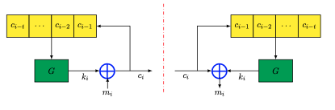

### Definition:
- Also called self-synchronizing stream ciphers
- One of the types of a [Stream Cipher](Stream%20Cipher.md)
### Properties:
- The key stream is generated as a function of a fixed number of previous ciphertext bits
- Limited error propagation (up to t bits)
- Resynchronise itself
	- After at most t bits later than synchronization is lost, it resynchronizes itself  
- Provide a good diffusion statistics
