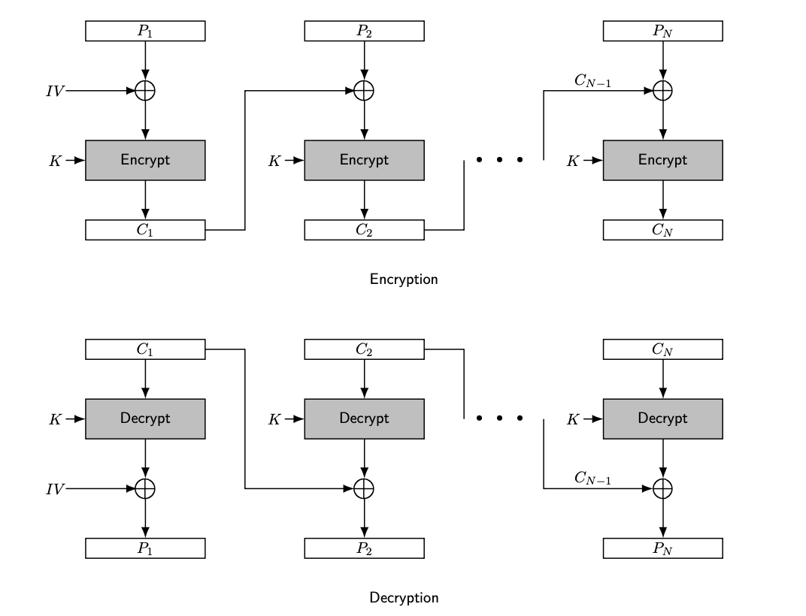

## CBC (Cipher Block Chaining)

### Definition:
- CBC is form of [Modes of Operations](Modes%20of%20Operations.md) to encrypt block cipher.
- Widely used in [DES](DES.md) and [AES](AES.md).
* CBC mode adds a feedback mechanism to the encryption process to disguise patterns in the plaintext.
### How It Works:
- The first plaintext block is XORed with an initialization vector (IV), and then encrypted. 
- Each subsequent block is XORed with the previous ciphertext block before being encrypted.
- If plain text $P_L$ is not n-bit block -> padding is required.
- Initialization vector (IV) used during xoring process
- Encryption:
	- $C_i = E_K(P_i \oplus C_{i-1})$
- Decryption:
	- $P_i = D_k(C_i) \oplus C_{i-1}$

### Properties:
- Encryption of a block depends on the encryption of previous block.
	- Good for [Diffusion & Confusion](Diffusion%20&%20Confusion.md)
- Encryption/decryption of each block is not independent from other blocks.
- Errors in a single block or malicious block substitutions propagates to next block.
- Self-synchronizing
	- After 2 block it self sync itself.
	- Because each block of plaintext is only dependent on the correct decryption of the immediate previous block of ciphertext.
  - No error correction
### Importance and Usage:
- **Pros**: 
	- Provides good data confidentiality by obscuring patterns in plaintext.
	- When it is combined with AES (i.e AES + CBC) is considered as semantically secured
- **Cons**: 
	- Encryption cannot be parallelized due to the chaining mechanism.
- **Usage**: 
	- Widely used in secure data transmission protocols like SSL/TLS for [HTTP](HTTP.md).