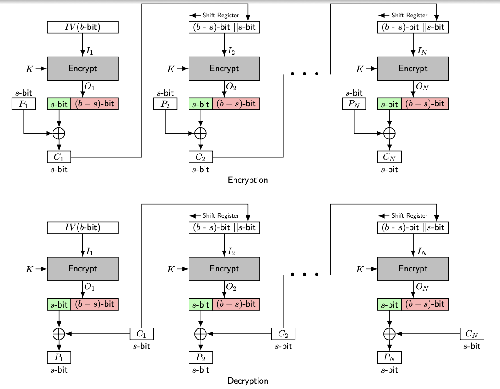

## CFB (Cipher Feedback)

### Definition:
- CFB is form of [Modes of Operations](Modes%20of%20Operations.md) to encrypt block cipher.
- Widely used in [DES](DES.md) and [AES](AES.md).
- [Stream Cipher](Stream%20Cipher.md) mode.
- CFB mode converts a block cipher into a stream cipher, allowing it to operate on smaller units of plaintext.
### How It Works:
- A block of the cipher's output is used as "feedback" to encrypt the next unit of plaintext, which can be smaller than the full block size.
- Uses initialization vector (IV).

### Properties:
 - Encryption of a block depends on the encryption of previous block.
	- Good for [Diffusion & Confusion](Diffusion%20&%20Confusion.md)
- Encryption/decryption of each block is not independent from other blocks.
- A single s-bit unit can be encrypted without waiting for entire block of data to be available
	- s is generally 8 (can be 1 to 8)
- Encryption of single s-bit unit depends on the encryption of previous s-bit.
- Error in single s-bit unit or malicious s-bit unit substations affect to the next s-bit units
- Self-synchronizing
	- After 2 block it self sync itself.
- Implementation of decryption is not needed.
	- Encryption process can be used for both decryption and encryption.
### Importance and Usage:
- **Pros**: 
	- Can work on data units smaller than the block size and does not require padding.
- **Cons**: 
	- Slightly more complex due to the feedback mechanism.
- **Usage**: 
	- Suitable for noisy channels, as it resynchronizes quickly if an error occurs.