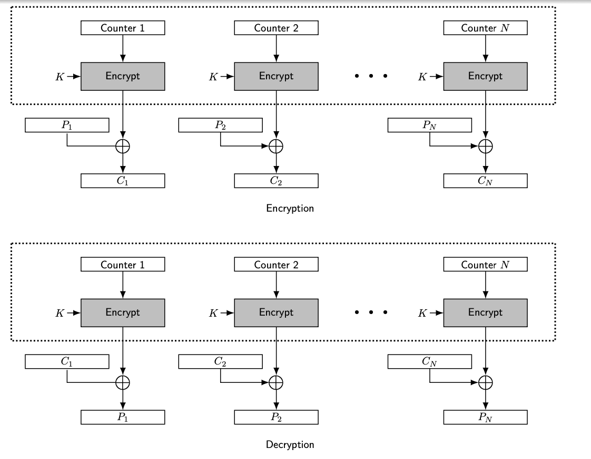

## CNT (Counter)

### Definition:
-  CNT is form of [Modes of Operations](Modes%20of%20Operations.md) to encrypt block cipher.
- Widely used in [DES](DES.md) and [AES](AES.md).
- [Stream Cipher](Stream%20Cipher.md) mode.
- CTR mode uses a counter value that is incremented for each block of plaintext, providing a unique input for the encryption of each block.
### How It Works:
- The counter (combined with a nonce) is encrypted, and the output is XORed with the plaintext to produce the ciphertext. 
- The same process is used for decryption.
-  Initial Vector (IV) used during xoring operation
	- Should not used twice (nonce)

### Properties:
- Cipher text blocks can be decrypted independently
	- Can be computed before encryption and decryption
	- Can be parallelized
	- Can perform selective decryption
		- can decrypt specific portions of the ciphertext without needing to process the entire sequence.
-  Loss of a block affects all coming blocks.
- Errors in a single block do not affect other blocks.
- Implementation of decryption is not needed.
	-  Encryption process can be used for both decryption and encryption.
- Counters are sync.
### Importance and Usage:
- **Pros**: 
	- Allows for parallel encryption and decryption.
		- High speed utilization
	- Allows random access to encrypted data blocks.
- **Cons**: 
	- Must ensure the counter value and IV is never reused with the same key.
- **Usage**: 
	- Highly suitable for high-speed network communications and disk encryption systems.