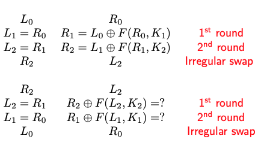

## Data Encryption Standard (DES)

### Type:
- [Symmetric Key Cipher](Symmetric%20Key%20Cipher.md) and [Block Cipher](Block%20Cipher.md)
### History: 
- Adopted as a federal standard in the U.S. in 1977.
- Replaced by AES as the federal standard in 2001 due to vulnerabilities.
### Key Length: 
- Key size: 64-bit key
- Effective key size: 56 bits.
	- 8 bits are used for parity bits (error checking purposes)
	- There are 4 weak keys
		- $E_{k}(E_{k}(\text{plaintext})) = \text{plaintext}$
		- i.e. Double encryption gives the plain text
		- [Weak Keys of DES](https://en.wikipedia.org/wiki/Weak_key#:~:text=DES%20weak%20keys%20produce%20sixteen,%2B%20'E'%20(0xFEFEFEFEFEFEFEFE))
	- There are 4 semi-weak keys
		- $E_{k_{1}}(E_{k_{2}}(\text{plaintext})) = \text{plaintext}$
- Since block size is fixed and 64-bit blocks to encrypt larger data blocks we use [Modes of Operations](Modes%20of%20Operations.md)
### Operation: 
- Involves permutation and substitution operations.
-  **Structure:** Uses a [Feistel Network](Feistel%20Network.md) structure with 16 rounds.
	- This led to both advantage and disadvantage
		- Advantage: same function can be used for both encryption and decryption
		- Disadvantage: in each iteration we decrypt or encrypt half of the block
- For Transformation it uses: 
	- S-boxes (substitution boxes)
	- P-boxes (permutation boxes)
- **Key Schedule:** Generates 16 48-bit round keys from the initial 56-bit key.
- Decryption and encryption functions are same
	- but round keys are applied in reverse order
	- 
- Designed for hardware
	- i.e. not efficient for software
> DES is not a group, i.e. Multiple encryption $\neq$ single encryption 
### Security: 
- Vulnerable to a brute-force attack due to its short key length.
- **Differential Cryptanalysis**
	- Analyze the differences in ciphertexts for suitably chosen plaintext pairs and deduce likelihood pf certain keys.
	- s-Boxes of DES optimized for differential cryptanalysis
		- i.e. designers aware of this problem
- **Linear Cryptanalysis**
	- Using 12 HP RISC workstations running at 99 MHz
	- with $2^{47}$ known plaintexts, the key was discovered in 50 days
	- s-Boxes of DES  ==not optimized== for linear cryptanalysis
- [Linear and Differential Cryptanalysis](https://www.geeksforgeeks.org/differential-and-linear-cryptanalysis/)
* COPACOBANA
	* Cost-Optimized Parallel Code Breaker
	* It breaks DES on average in 8.7 days
### Current Status:
- Considered insecure for many modern applications.
- Two other alternatives:
	- [2DES](2DES.md)
	- [3DES](3DES.md)
- Largely replaced by [AES](AES.md) in various applications.
