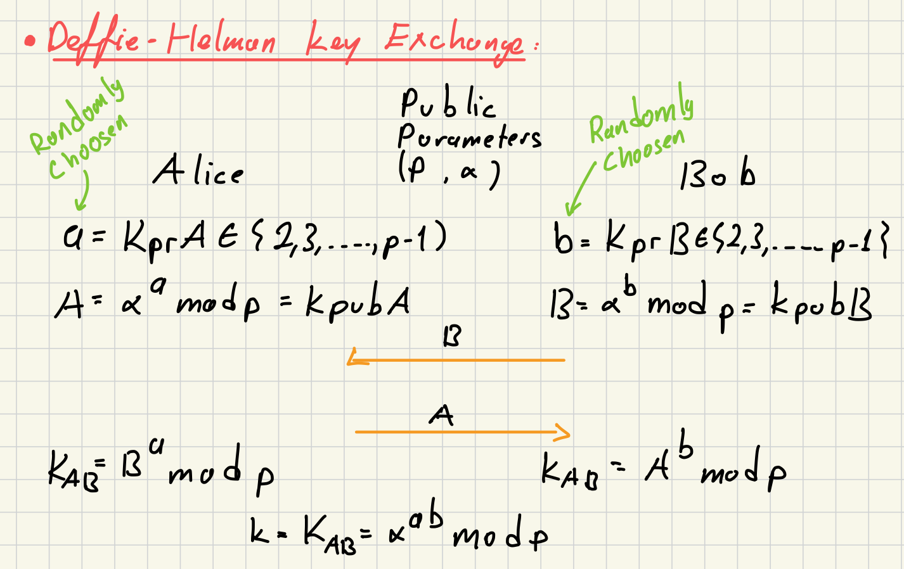
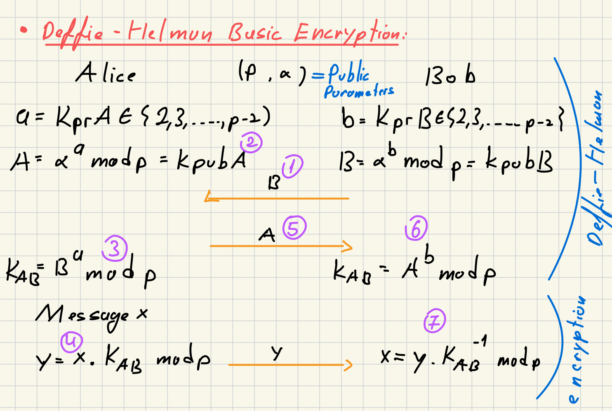

### Definition:
- Proposed in 1976 by Diffie-Hellman
- Use [Discrete Logarithm (DL)](Discrete%20Logarithm%20(DL).md) problem on any finite [Group](Group.md)
### Protocol:
- **Setup Phase:**
	- Find a large prime p
	- Find a primitive element $\alpha$ in $Z_p^*$ or in a subgroup of $Z_p^*$
		- $\alpha$ is generator in $Z_p^*$
- **Key Exchange:**

### Security:
- Adversary observe
	- p, $\alpha$, A($p_A$ public key of Alice),  B($p_B$ public key of Bob)
	- He needs to know either a ($s_A$) or b $(s_B)$
- Finding a ($s_A$) or b $(s_B)$ is a discrete logarithm problem
	- $s_A = \log_{\alpha}p_A$ or $s_B = \log_{\alpha}p_B$ which is a hard problem
### Encryption Protocol:
- [ElGamal](ElGamal.md) encryption protocol based on this basic protocol
	- Main difference ElGamal is probabilistic so its secure
	- ElGamal s more efficient than Diffie-Hellman
