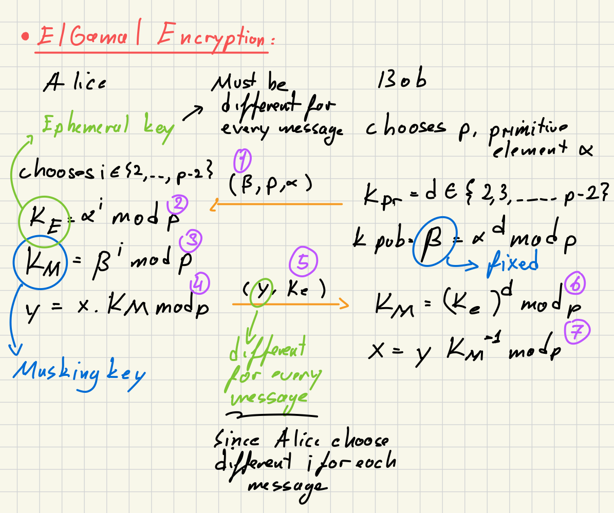

#NotFinished
### Definition:
-  Invented by 1985 by Taher ElGamal
- Based on [Discrete Logarithm (DL)](Discrete%20Logarithm%20(DL).md) problem on any finite [Group](Group.md)
- Ephemeral parameters (keys) = temporal key (parameters) not used in long time
	- Must be different for every message to be encrypted
### Encryption Protocol:

### Efficient Implementation:
### Security:
- 'd' and 'i' (i.e. the private keys of Alice and Bob) so they must be kept in secret and chosen randomly for each message
- ElGamal is probabilistic algorithm since it randomly chooses different 'i' and 'd' for every encryption so it is a secure encryption algorithm