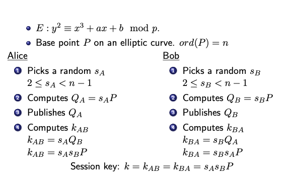
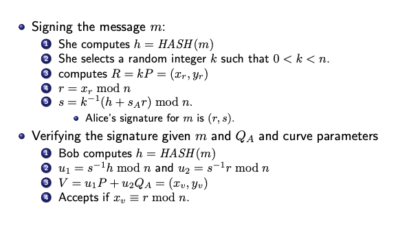

### Definition:
- First proposed for cryptographic usage in 1985 independently by Neal Koblitz and Victor S. Miller
- Based on [Discrete Logarithm (DL)](Discrete%20Logarithm%20(DL).md) problem on [Finite Fields](Finite%20Fields.md)$(GF(p))$
	- Group operation is addition.
- 160-bit ECC security = 1024-bit RSA security
### Eliptic Curves over $GF(p)$:
- The elliptic curve equation
	- $E : y^2 = x^3 + ax + b$ where $0 \leq a,b < p$
	- the curve should be non-singular 
		- (i.e curve has no self-intersections, cusps, or isolated points)
		- To guarantee that check discriminant $\Delta$
		- $\Delta = -16(4a^3+27b^2) \neq 0$
- Two points on E:
	- $P = (x_p,y_p)$ and $Q=(x_q,y_q)$ where $0 \leq x_p,y_p,x_q,y_q <p$
		- This base point P is also a generator
	- Point Infinity (0, 0) = O
		- Neutral element in the group
		-  Always add point infinity to total number of points $\# E(F_p)$
	- Tp find number of points in the curve Hasse bound gives us a lower and upper bound:
		- $|n-p-1|<2\sqrt{p}$
- Addition:
	- $R=P+Q=(x_r,y_r)$  
	- $y=\lambda x+\beta$  where 
	- if $P \neq Q$ -> $\lambda =\huge\frac{y_q-y_p}{x_q-x_p}$ mod p
	- if $P = Q$ -> $\lambda =\huge\frac{3x_p^2 +a}{2y_p}$ mod p
	- $x_r = \lambda^2 -x_p -x_q \mod p$
	- $y_r = -y_p + \lambda(x_p-x_r) \mod p$
### Elliptic Curve DL Problem:
- The point addition operation is actually Scalar Multiplication:
	- $Q = kP = \underbrace{P+P+\dots+P}_{\textbf{k times}}$
	- It is computationally infeasible (it is inefficient)
	- Security of EC depends on size of k
		- k must be > 256 bit
		- DLP in EC is much harder than DLP in integers
			- index calculus method do not work so we can use much smaller bits to reach same security level
			- Shanks and Pohling-Hellman Algorthim require minimum: $n >2^{224}$
		- 224-bit ECC security = 2048-bit RSA security
- To calculate it in an efficient way we use binary representation of k
	- Left-to-Right Algorithm
		- if bit = 1 -> Multiply with 2 and add P
		- if bit = 0 -> Multiply with 2
### ECDH Key Exchange:

### EC Digital Signature Algorithm (ECDSA)
- Curve(domain) parameters $(a,b,p,P)$ and $Q_A$(public key) are published
- $s_A$ is kept private

