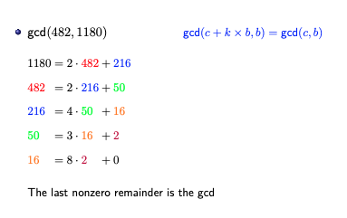

### Theorem: 
- For any pair of non-negative integers a and b, where $a \geq b$, the GCD of a and b is equal to the [GCD](GCD.md) of b and $a \mod b$.
- $gcd(a, b) = gcd(b, a \mod b)$
- **Extended Euclidian Algorithm:**

