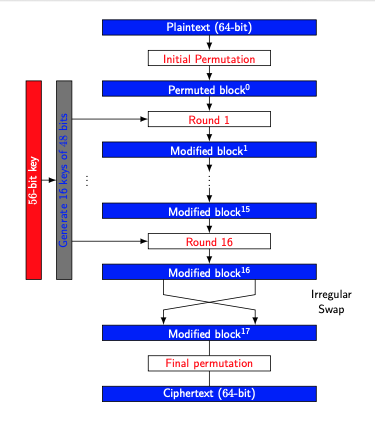

* The encryption process uses the Feistel structure consisting multiple rounds of processing of the plaintext, each round consisting of a “substitution” step followed by a permutation step.
* One round of a Fiestel System
	* 
* 16 Rounds of DES
	* 
* Due to the Fiestel network system [DES](DES.md) encryption and decryption functions are same.