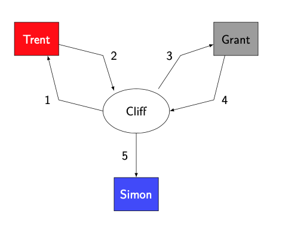
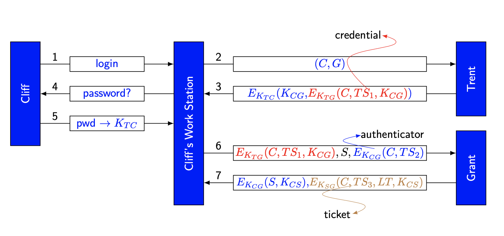
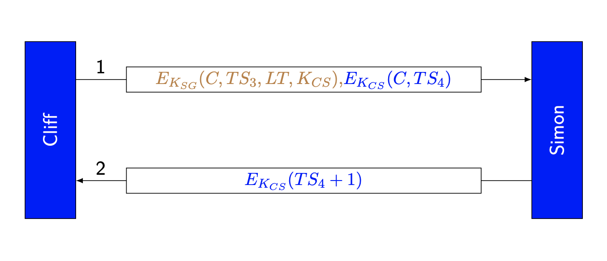

### Definition:
- Kerberos originated from a larger project in M.I.T. called Athena.
	- Athena was originally designed for connecting a huge network of workstations so that students can securely access their files from anywhere in the net.
- Uses only [Symmetric Key Cipher](Symmetric%20Key%20Cipher.md)
- Provides security and authentication in [Key Establishment Protocols](Key%20Establishment%20Protocols.md) between users in a network
- Users could be programs as well as individuals  
- Uses [Key Distribution Center (KDC)](401/CS411/Key%20Distribution%20Center%20(KDC).md) idea called Trent
### Model:
- Based on a client-server architecture.  
	- A client is either a user or a software that has some tasks to Sends an e-mail, print documents, mount devices, etc.
	- Servers are larger entities whose function is to provide services to the clients.
- Roles
	- Cliff:
		- Client
		- requests a service from Simon
			- they do not have any shared secret
		- Kerberos give them a secret information securely so that they can interact secretly.
	- Simon:
		- Service provider  
		- Receives Cliff’s ticket and fulfills Cliff’s service request
	- Trent: 
		- Authentication server -> Trusted authority
		- shares secret information (e.g., a password) with each user in the system
		- issues credentials to Cliff when he first logins.
			- with this credential Cli can authenticate himself
		- [Key Distribution Center (KDC)](401/CS411/Key%20Distribution%20Center%20(KDC).md)
	- Grant:
		- Ticket granting server
		- After Cliff logins to the system -> Grant issues him a ticket to use any particular service
		- Cliff presents his credentials (issued by Trent) to Grant to get this new ticket
		- Ticket contains information, from which Cliff and Simon generates a shared 
	- 
### Operation:
- $K_{AB}$ = key that entity A and entity B share
	- $K_{TG}$ = key Grant and Trent share
	- $K_{TS}$ = key Grant and Trent share
- $TS_i$ = timestamp
- $LT$ = Validity period of the ticket (lifetime)
- $E_{K_{AB}}()$ = encryption via using $K_{AB}$ 
- Credential = $E_{K_{TG}}(C,TS_1,K_{CG})$
- Authenticator = $E_{K_{CG}}(C,TS_2)$
- **Authentication Operation:**
	
- **Use of Service:**
	
### Security:
* Timestamps are used
	* Hosts must provide both secure and synchronized clocks
* Security of Kerberos
	* If the shared key between Trent and Cliff are passwords
	* protocol is no more secure than the strength of the password
	* No [Forward Secrecy](Forward%20Secrecy.md)
- Reuse of tickets
	- The lifetime of a ticket allows reuse of the ticket for multiple interactions with no additional interactions with Grant
- Optional keys
	- $K_C$ and $K_S$ allow Cliff and Simon to combine these keys
		- derive another key $F(K_C,K_S)$
	- Do not additional security to protocol -> they only generate new session key no more