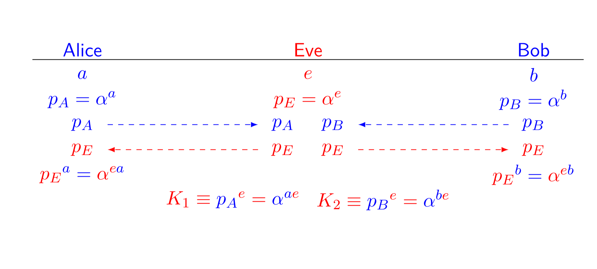

### Definition:
- A type of attack that used to break authentication
- to protect from that attack -> need a separate authentication system.
- [Diffie-Hellman Key Exchange](401/CS411/Diffie-Hellman%20Key%20Exchange.md) do not secure to this attack
	- so it does not provide authentication during key exchange
### Operation:
