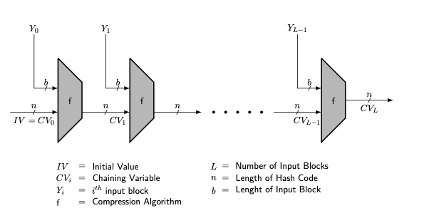

### Defintion:
- Method of building collision-resistant [Cryptographic Hash Functions](Cryptographic%20Hash%20Functions.md) from collision-resistant one-way compression functions.
- [MD5](MD5.md), [SHA-1](SHA-1.md), and [SHA-2](SHA-2.md) family, are based on the Merkle-Damgård construction.
- For Detailed information about [Merkle-Damgard Scheme](https://www.geeksforgeeks.org/merkle-damgard-scheme-in-cryptography/)
### Properties:
* It is used to ensure that the hash function can handle inputs of arbitrary size while maintaining security properties like collision resistance.
- **Collision Resistance**:
	- If the compression function is collision-resistant, the whole hash function is collision-resistant.
- **Fixed Output Size**: 
	- Despite the variable length of the input, the output size is fixed.
- **Efficiency**: 
	- The construction can efficiently process very long messages.
### Operation:
1. **Padding**: 
	- The input message is padded so that its length is congruent to a certain value modulo the block size. 
	- The padding usually includes the length of the original message.
2. **Block Processing**: 
	- The padded message is divided into fixed-size blocks. 
3. **Iterative Processing**:
	- A compression function is applied iteratively to each block of the message. 
	- The output of each step is combined with the next block of the message and fed into the compression function again.
	- This process continues until all blocks are processed.
4. **Final Output**: 
	- The output of the final block processing step is the hash value of the entire message.

### Current Status:
The Merkle-Damgård construction has been fundamental in the design of cryptographic hash functions. However, as cryptography has evolved, newer designs have emerged to address its limitations, especially in the face of increasingly sophisticated cryptographic attacks.
