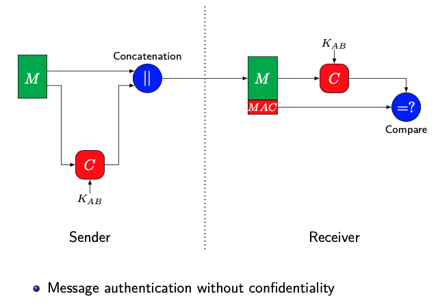
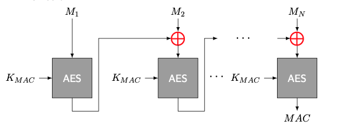

## Message Authentication Codes (MAC):
### Definition: 
- MAC is a short, fixed-length bit string derived from a message using a secret key.
- It ensures that the message comes from the alleged source and has not been altered.
- Similar to encryption, however it does not have to be reversible
	- Many to one function
- MAC is not a signature
	- since receiver also can generate
	- do not provide [non-repudiation](https://www.cryptomathic.com/products/authentication-signing/digital-signatures-faqs/what-is-non-repudiation#:~:text=Non%2Drepudiation%20is%20the%20assurance,origin%20and%20integrity%20of%20data.)
### Process: 
- The sender calculates the MAC using a secret key shared with the receiver and appends it to the message. 
- The receiver recalculates the MAC to verify the message's integrity

### Types
- **CMAC**: 
	- Cipher Based Message Authentication
	- Uses [Block Cipher](Block%20Cipher.md) like [AES](AES.md)  for message authentication
		- Providing both confidentiality and authentication
	- Does not need a separate implementation for hash functions since it satisfy confidentiality and authentication by its cipher nature
	
- **HMAC**: 
	- Hash Based Message authentication
	-  Uses [Cryptographic Hash Functions](Cryptographic%20Hash%20Functions.md) like any function that we covered
	- Faster than CMAC 
	- Internet standart
	- Originally hash function do not use key
		- Solution: hash includes a key along with the message
			- Initial Design: `KeyedHash = Hash(Key || Message)`
			- Current Design : `HMAC = H[(K+ ⊕ opad) || H[(K+ ⊕ ipad)|| M)]]`
				- `K+` is the key padded to the block size of the hash function
				- `opad` and `ipad` are padding constants.
	- HMAC relies on hash functions ==for authentication not for confidentially==
	- Providing both authentication and confidentially in a faster way
		- Authenticated Encryption with Associated Data ([AEAD](AEAD.md))
