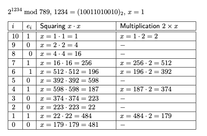

#MathBackground 
### Definition:
- Fundamental operation in many cryptographic algorithms, including [RSA](RSA.md).
- Essential for public key encryption([PKC](PKC.md)) and digital signature 
### Operation: 
- $m^e\mod n$
- **Naive Method:** compute $m^e$ than take its modulus n
- **Practical Method:** use binary expansion of the exponent
	- Binary Left-to-Right Algorithm
		- for every bit of e (e example: 1234 = $(10011010010)_2$)
			- initialise x = 1
			- $x = x \times x\mod n$
			- if $e_i = 1$ multiply x by 2
		- [BinaryLefttoRightalgortihm.png](../../Attachments/BinaryLefttoRightalgortihm.png)
	- [BinaryRighttoLeftAlgorithm.png](../../Attachments/BinaryRighttoLeftAlgorithm.png)
### Example:
