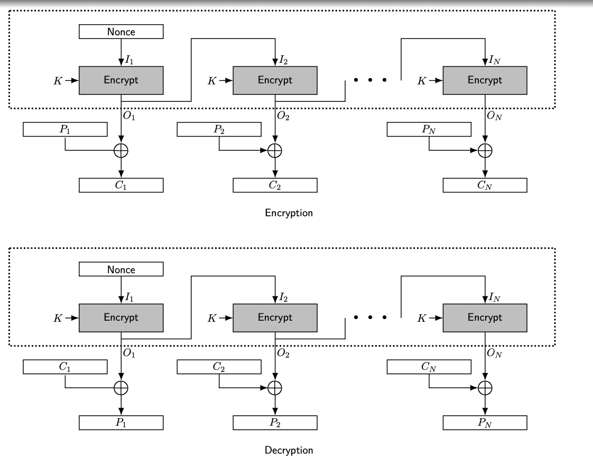

## OFB (Output Feedback)

### Definition:
 - OFB is form of [Modes of Operations](Modes%20of%20Operations.md) to encrypt block cipher.
- Widely used in [DES](DES.md) and [AES](AES.md).
- [Stream Cipher](Stream%20Cipher.md) mode.
- OFB mode turns a block cipher into a synchronous stream cipher, generating key stream blocks that are independent of both the plaintext and ciphertext.
### How It Works:
- A seed value is encrypted repeatedly to produce a key-stream, then XORed with the plaintext to produce ciphertext.
- Initial Vector (IV) used during xoring operation
	- Should not used twice (nonce)

### Properties: 
- Key-stream generation cannot be parallelized.
	- Can be computed before and stored for encryption/decryption
- Implementation of decryption s not needed.
	-  Encryption process can be used for both decryption and encryption.
- Loss of block affects all coming blocks.
- Errors in a single block do not affect other blocks.
### Importance and Usage:
- **Pros**: 
	- The encryption process can be done in advance.
	- Errors do not propagate.
- **Cons**: 
	- Requires a unique IV for every encryption session to ensure security.
- **Usage**: 
	- Useful for streaming data encryption where error propagation cannot be tolerated.