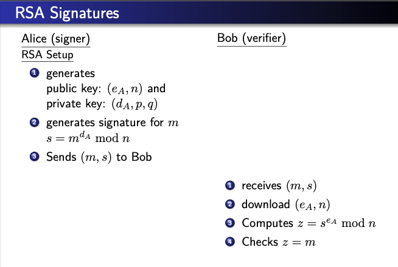
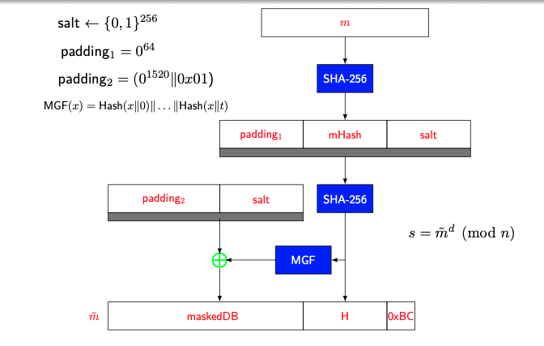
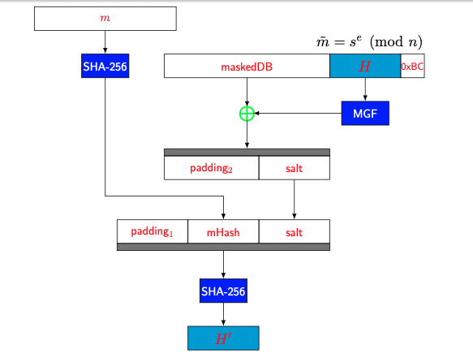

- An implementations of [Digital Signature Algorithm (DSA)](401/CS411/Digital%20Signature%20Algorithm%20(DSA).md) by using [RSA](RSA.md)

### RSA-PSS:
- **Probabilistic Signature Generation:**
	- 2048 bit

- **Signature Verification:**
