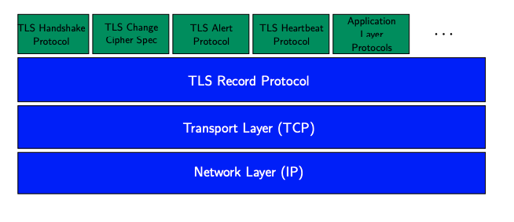
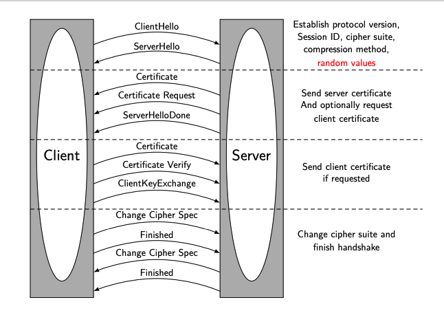
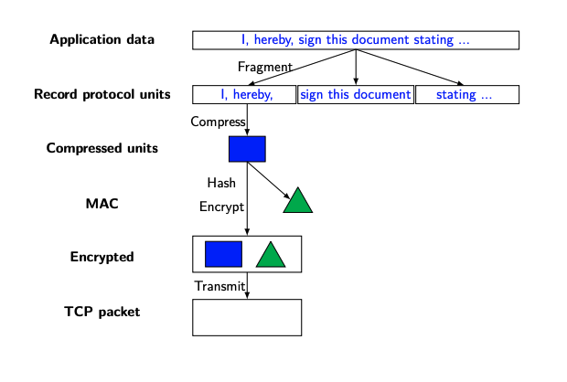
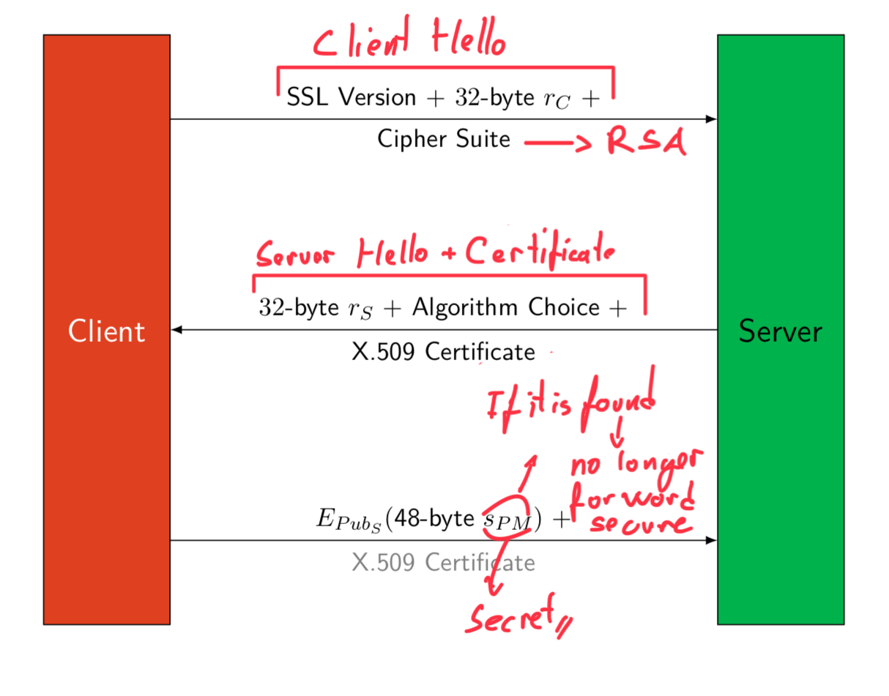
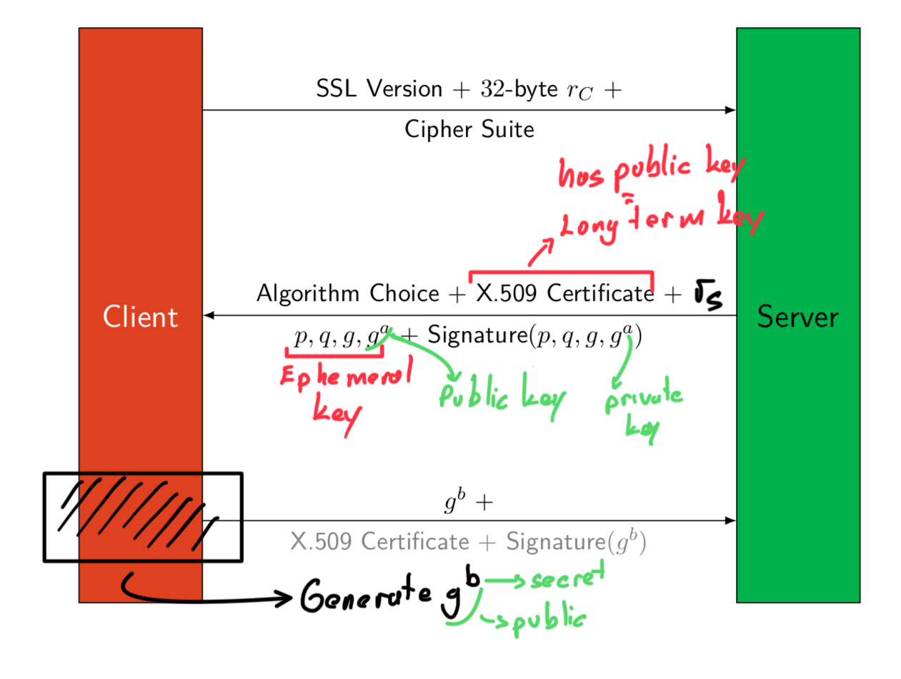

### Secure Socket Layer (SSL):
- Developed by Netscape in the mid-1990s
- First protocol designed for securing [The Internet](../CS408/The%20Internet.md) connections
- SSL 3.0 -> TLS 1.0
- Widely used for securing [HTTP](../CS408/HTTP.md) connections
- [X.509 Certificates](X.509%20Certificates.md) use this method
### Transport Layer Security (TLS):
- TLS is the successor to SSL
- Introduced in 1999 by the Internet Engineering Task Force (IETF)
- More secure than SSL
- TLS is backward compatible with SSL 3.0
	- TLS 1.0 = SSL 3.0
	- Use of SSL 3.0 is now strongly discouraged due to security vulnerabilities.
- **TLS(1.2) Key Exchange Technique:**
	- [RSA](RSA.md):
		- The server sends its RSA public key with X.509 certificate
		- The client generates a Pre-master Secret and encrypt using server’s public key.
		- No Forward Secrecy
	- Fixed [Diffie-Hellman Key Exchange](Diffie-Hellman%20Key%20Exchange.md):
		- The server sends its DH public key with X.509 certificate
		- he client generates a DH key pair. 
		- Pre-master secret is computed using the output of DH.
		- No Forward Secrecy
	- Anonymous [Diffie-Hellman Key Exchange](Diffie-Hellman%20Key%20Exchange.md):
		- No authentication mechanism is used for DH public keys. 
		- Self-signed certificates are used.
		- No Forward Secrecy
		- open to [Man-in-the-Middle Attack](Man-in-the-Middle%20Attack.md)
	- Ephemeral [Diffie-Hellman Key Exchange](Diffie-Hellman%20Key%20Exchange.md)
		- The server generates a unique DH key pair for each session.
		- Ephemeral DH public key of the server is signed using the signature key of the server  
		- Has [Forward Secrecy](Forward%20Secrecy.md) since for each session we generate new key
### Properties:
- Authentication of server -> Use [Certificates](Certificates.md) and [Asymmetric Key Cipher](Asymmetric%20Key%20Cipher) 
	- Use [PKC](PKC.md) to establish secret keys
- Encrypts data by using [Symmetric Key Cipher](Symmetric%20Key%20Cipher.md) 
	- Preventing eavesdropping and tampering
	- Hybrid encryption scheme
### Structure:
- TLS record protocol implements a secure channel encrypting and authenticating messages in any connection-oriented protocol

- **Handshake Protocol:**
	- If the certificate did not asked since it s optional ask the password of client
	
- **Record Protocol:**
	- If data is > 69 bytes  -> fragment
	- Uses Mac-then-Encrypt method in [AEAD](AEAD.md)
	
### Session vs. Connection:
- TLS session is association between client and server
	- Session created with Handshake protocol  
	- Multiple connections can be associated with one session
- State information is stored after Handshake protocol (using Session ID)
	- Session: ID, certificate, compression, cipher spec, master secret, is-resumable
		- done one time -> if reusable flag is 1
	- Connection: random values, encrypt keys, MAC secrets, IV, sequence numbers
		- done again and again for each
- To initiate
	- session: All phases of handshake are done. 
	- connection: Only phase 1 and 4 are done.
- Provide efficiency by using same session for different connections
### Operation
- SSL 3.0/TLS 1.0 Key Exchange with RSA
	- Master secret key: $s_{PM}$ -> pre master key
		 $MD5(s_{PM}||SHA1(C||s_{PM}||r_C||r_S))||$
		 $MD5(s_{PM}||SHA1(pad_0||s_{PM}||r_C||r_S))||$
		 $MD5(s_{PM}||SHA1(pad_1||s_{PM}||r_C||r_S))$
	-  Master secret key æ key block
		- Six secrets from the key block  
		- 2 keys for confidentiality (for each direction)  
		- 2 keys for authentication (for each direction)
			- [Message Authentication Codes (MAC)](Message%20Authentication%20Codes%20(MAC).md)
		- 2 initial values for CBC mode of the block cipher
	- Not forward secure since if $s_{PM}$ found all previous information can be decrypted
	
- TLS 1.2 Key Exchange with Ephemeral DH
	- Has forward secrecy
	
- TLS 1.3 Key Exchange with Ephemeral DH
	- Only allowed key exchange technique is Ephemeral DH
	- Forward Secrecy is a default feature.
	- 1-RTT Handshake
		- Key exchange algorithm is removed from cipher suite.
		- Ephemeral Keys and X.509 certificate are send in Client Hello and Server Hello messages.
		- There is no need for Phase 2&3