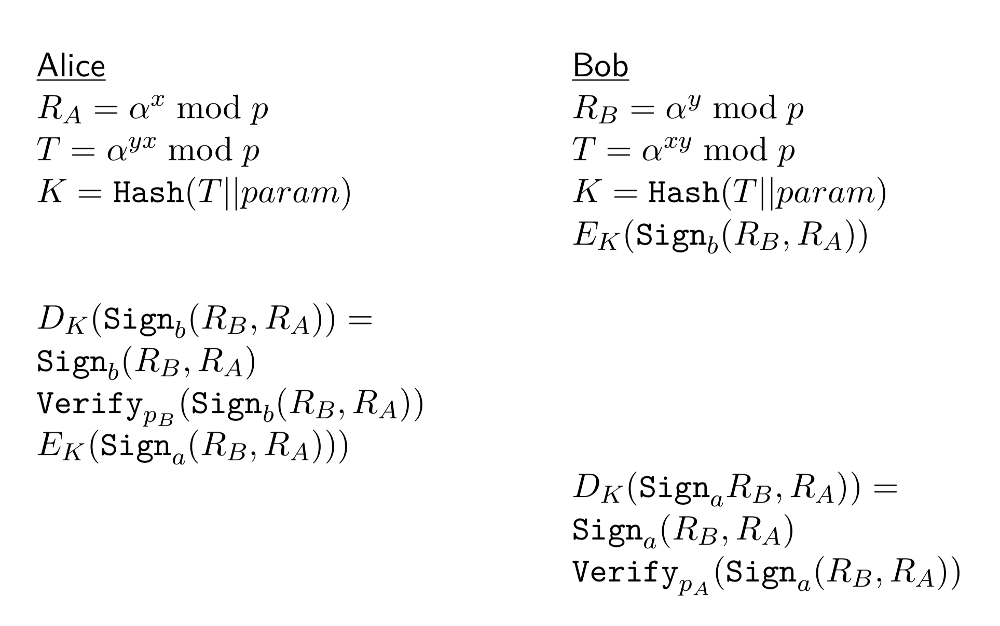

### Definition:
- Authenticated key agreement protocol
- Based on [Diffie-Hellman Key Exchange](Diffie-Hellman%20Key%20Exchange.md)
- Additionally provides mutual key and entity authentication
	- protection from [Man-in-the-Middle Attack](Man-in-the-Middle%20Attack.md)
- Provides [Forward Secrecy](Forward%20Secrecy.md)
### Operation:
- Alice and Bob use their private keys to sign the exchanged messages
- Sign function -> $Sign_{sk}()$
- Verify function -> $Verify_{pk}()$
- Public keys are obtained from public trusted database
- Alice:
	- Private key -> a
	- Public key -> $p_A = \alpha^a \mod p$
- Bob:
	- Private key -> b
	- Public key -> $p_B = \alpha^b \mod p$
