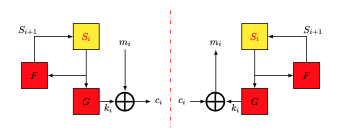

### Defintion:
- One of the types of a [Stream Cipher](Stream%20Cipher.md)
### Properties:
- Sender and receiver must be synchronized. 
	- Resynchronization is needed.
- Key-stream is independent of plaintext and ciphertext.
	- Good for confusion
- No error propagation.
- Active attacks can easily be detected (i.e. insertion, deletion, replay)
