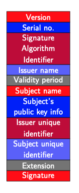
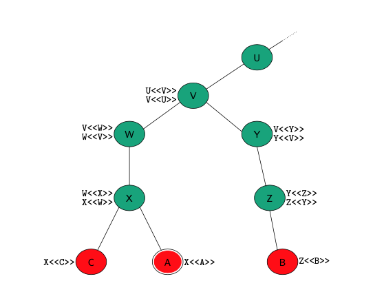

### Definition:
- International standard by ITU-T
- Designed to provide authentication services on large computer networks
- Initially issued in 1988 
- Specifies public-key certificate format
- Used in Visa and Mastercard’s SET standard, in S/MIME, IP Security, and [SSL-TLS](SSL-TLS.md)
### Format:
- CA<<\A>> : the certificate of user A issued by certification authority CA.  
	- How we know public key of CA? -> they share theşr key by browser developers
- $CA<<A>> = CA\{V,SN,AI,CA,T_A,A,Ap\}$
	- V= Version
	- SN = Serial Number 
	- AI = Algorithm Identifier
	- CA = Issuer Name
	- $T_A$ = Validity Period
	- A = Subject name
	- Ap = Subject public key info

### Certificate Chains:
- A can acquire following certificates from the directory to establish a certification path to B
	- $X<<W>>, W<<V>>, V<<Y>>, Y<<Z>>, Z<<B>>$ 
- B does the same thing:
	- $Z<<Y>>, Y<<V>>, V<<W>>, W<<X>>, X<<A>>$
- 